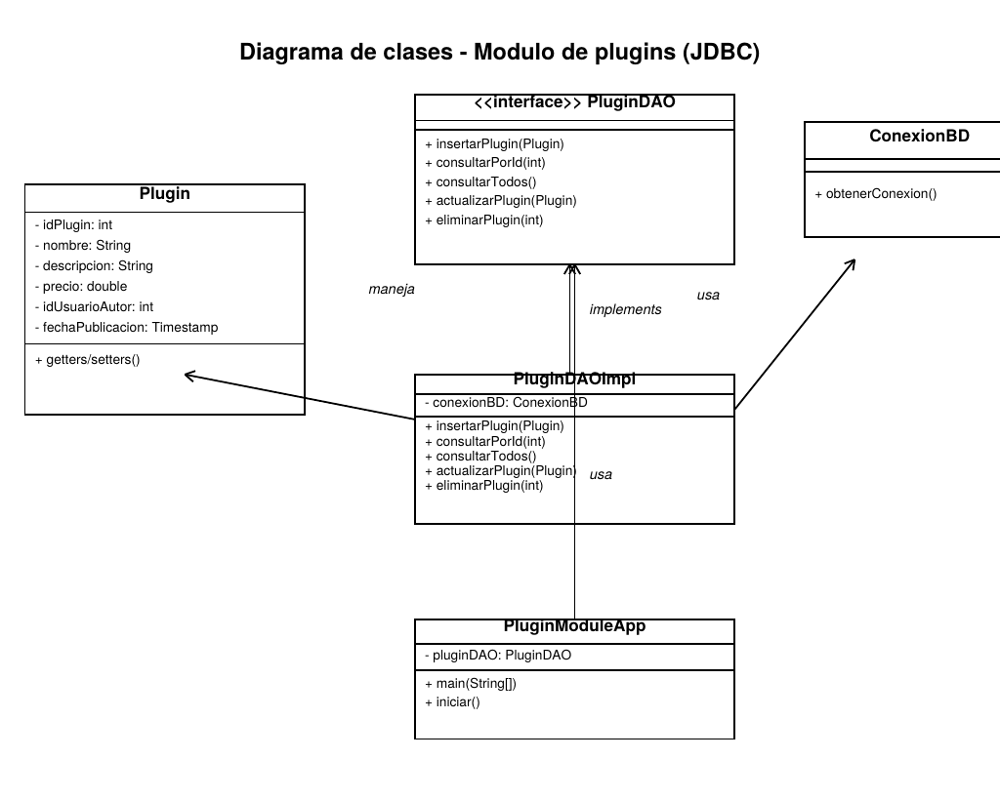

# Módulo de Plugins — Conexión JDBC (GA7-220501096-AA2-EV01)

Aprendiz: **Juan Sebastián Villarreal Díaz** — Ficha 3186586
Programa: Tecnólogo en Análisis y Desarrollo de Software
Instructor: Juan Camilo Ospina Cuervo

## 1. Contexto dentro del proyecto formativo

Este módulo hace parte del proyecto final **"Tienda de plugins de Rust"**, una
plataforma construida con arquitectura de microservicios (Spring Boot) donde
cada servicio tiene su propia base de datos MySQL independiente.

Esta evidencia se enfoca puntualmente en el **microservicio plugin-service**,
codificando en Java, con **JDBC puro** (sin frameworks como Spring Data ni
Hibernate, tal como lo pide el componente formativo "Construcción de
aplicaciones con JAVA"), las cuatro operaciones básicas sobre la tabla
`plugin_db.plugin`.

Artefactos previos del ciclo de vida del software que se tuvieron en cuenta
para esta codificación:

- **Modelo conceptual y lógico** de la base de datos — evidencia
  `GA4-220501095-AA1-EV01`.
- **Script físico de la base de datos** (`plugin_db`, tabla `plugin`) — evidencia
  `GA6-220501096-AA2-EV03`.
- **Diagrama de clases** del módulo (`diagrama_clases.png`, incluido en este
  repositorio), que sirvió de referencia directa para la codificación.

## 2. Diagrama de clases



## 3. Estándares de codificación aplicados

| Elemento   | Convención          | Ejemplo                          |
|------------|----------------------|-----------------------------------|
| Paquetes   | minúsculas, sin guiones bajos | `com.rustplugins.pluginmodule.dao` |
| Clases     | PascalCase           | `PluginDAOImpl`, `ConexionBD`     |
| Interfaces | PascalCase           | `PluginDAO`                       |
| Métodos    | camelCase, verbo + sustantivo | `insertarPlugin`, `consultarPorId` |
| Variables  | camelCase, descriptivas | `idPlugin`, `conexionBD`, `sentencia` |
| Constantes | MAYÚSCULAS_CON_GUIONES | `SQL_INSERTAR`, `ARCHIVO_CONFIGURACION` |

## 4. Estructura del proyecto

```
plugin-jdbc-module/
├── pom.xml
├── diagrama_clases.png
├── src/main/java/com/rustplugins/pluginmodule/
│   ├── modelo/Plugin.java          -> clase de dominio (POJO)
│   ├── conexion/ConexionBD.java    -> apertura de la conexión JDBC
│   ├── dao/PluginDAO.java          -> contrato CRUD
│   ├── dao/PluginDAOImpl.java      -> implementación JDBC (PreparedStatement)
│   └── app/PluginModuleApp.java    -> menú de consola para probar el CRUD
└── src/main/resources/config.properties  -> datos de conexión (no hardcodeados)
```

## 5. Funcionalidades implementadas (CRUD)

| Operación | Método | Sentencia SQL |
|---|---|---|
| Insertar | `insertarPlugin(Plugin)` | `INSERT INTO plugin (...)` |
| Consultar todos | `consultarTodos()` | `SELECT ... FROM plugin` |
| Consultar por id | `consultarPorId(int)` | `SELECT ... WHERE id_plugin = ?` |
| Actualizar | `actualizarPlugin(Plugin)` | `UPDATE plugin SET ... WHERE id_plugin = ?` |
| Eliminar | `eliminarPlugin(int)` | `DELETE FROM plugin WHERE id_plugin = ?` |

Todas las consultas usan **PreparedStatement** (nunca concatenación de texto),
para prevenir inyección SQL.

## 6. Cómo ejecutarlo

1. Tener MySQL corriendo y la base de datos `plugin_db` creada (ver evidencia
   `GA6-220501096-AA2-EV03`).
2. Ajustar `src/main/resources/config.properties` con el usuario y la clave de
   su propio entorno.
3. Compilar y ejecutar con Maven:
   ```
   mvn clean package
   java -cp target/plugin-jdbc-module.jar com.rustplugins.pluginmodule.app.PluginModuleApp
   ```

## 7. Validación realizada

Antes de entregar esta evidencia, la lógica de acceso a datos (`PluginDAOImpl`)
fue compilada y ejecutada contra un servidor MySQL/MariaDB real, confirmando
que las cuatro operaciones (insertar, consultar, actualizar, eliminar)
funcionan correctamente, incluyendo casos de error controlados (consultar o
eliminar un id que no existe).

## 8. Control de versiones

Este proyecto se entrega inicializado con Git (`git log` conserva el
historial de commits). El archivo `enlace_repositorio.txt` contiene el
enlace al repositorio remoto donde se publicó el proyecto.
